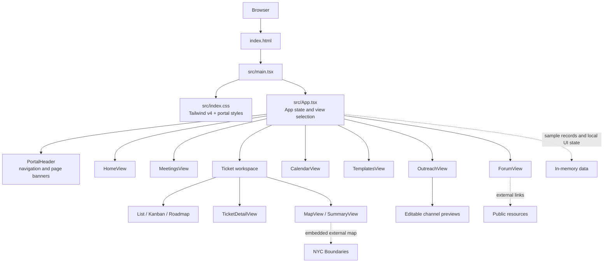

# Loopback Community Board Portal

Loopback is a React portal prototype for Manhattan Community Board 3 (CB3). It brings together meeting preparation, ticket tracking, a meeting calendar, document templates, outreach drafting, and a board-to-board forum in one responsive interface.

## Portal Guide

The top navigation contains seven sections:

| Section | What it contains |
| --- | --- |
| **Home** | CB3 welcome, links to common workflows, and a search field that opens Tickets with matching records. |
| **Meetings** | A video file picker and optional meeting-minutes field for preparing meeting assets. |
| **Tickets** | Searchable and status-filtered sample tickets, with List, Kanban board, and Roadmap views. The List view also has Map and Summary panels. Selecting a ticket opens its full detail page. |
| **Calendar** | A monthly calendar and upcoming committee and board events. |
| **Templates** | A gallery of sample document templates and recent documents. |
| **Outreach** | Sample resolutions and community wins, their attachments, per-record channel toggles, and editable post previews for Instagram, Facebook, X, Blog, and Newsletter. |
| **Forum** | Sample board-to-board questions and replies, with community resource links in a side rail. |

Every section ends with a shared black footer containing the Loopback logo and a static Contact Us label.

### Common workflows

**Upload meetings:** Upload meeting transcript and drafts for tickets, documents, and outreach posts are generated based on discussion topics.

**Find tickets:** Open Tickets, search by ticket number, title, type, or location, and optionally filter by status. Use List, Kanban board, or Roadmap to change the view. Select a row, card, roadmap event, or map pin to open the ticket detail page. Use Back to tickets to return to the ticket workspace. The List view's Map and Summary tabs switch the right-hand panel.

**Search from Home:** Enter a phrase in the Home search field and submit.

**Prepare outreach:** Select an outreach record. Toggle the icons in its Channels column to choose where that record should be prepared. Enabled channels appear available in the composer tabs. Edit the copy directly inside the post preview and use Post to mark the local draft as posted.

**Join the forum:** Add a question with a title and details, or reply to an existing discussion. Use the left-side resource links to open public references.

## Architecture

The app is a client-side single-page application. Tab navigation and shared ticket state live in `App`; the current tab selects a view component. The interface does not currently use a router, database, or application API.



### Project structure

```text
.
├── index.html                 # Vite HTML shell
├── package.json               # Scripts and dependencies
├── pnpm-lock.yaml             # Locked dependency graph
├── vite.config.ts             # Vite, React, Tailwind, and Figma Make setup
├── public/
│   ├── cb3_hero.jpg            # Home and sample outreach preview image
│   └── mancb3_logo.png         # Community board brand asset
└── src/
	├── App.tsx                 # Portal views, sample data, and UI state
	├── index.css               # Tailwind import and global/component styles
	├── main.tsx                # React entry point
	├── assets/logo.png         # Loopback logo
	└── vite-env.d.ts           # Vite TypeScript declarations
```

Most page components currently live in `src/App.tsx`; shared design and responsive rules live in `src/index.css`. `lucide-react` supplies interface icons, and `simple-icons` supplies platform brand marks.

## Development

Requirements: Node.js 22.12 or later and pnpm 10. Install dependencies and start Vite:

```bash
pnpm install --frozen-lockfile
pnpm dev
```

The Vite configuration binds to `0.0.0.0` and uses `PORT` when set; the default port is `8443`. Open the URL printed by Vite. If the port is already taken, choose another one:

```bash
PORT=8444 pnpm dev
```

Available scripts:

```bash
pnpm build    # Production build
pnpm preview  # Serve the production build locally
pnpm format   # Format files with oxfmt
```

## Current Prototype Boundaries

- Ticket, calendar, template, outreach, and forum content is sample data in the frontend. Changes are not persisted to a server or database.
- Outreach channel toggles, edited copy, and the Posted state are local UI state. The Post action does not publish to Instagram, Facebook, X, a blog, or an email service; no social accounts or publishing integrations are configured.
- Outreach attachment thumbnails use the existing CB3 hero image as sample media. The filenames and media records are illustrative, not uploaded files.
- Meetings currently provides file and minutes controls, but does not upload, store, transcribe, or generate documents yet.
- Forum questions and replies are held in component state and are lost when the page is reloaded or the view is remounted.
- Calendar entries are curated sample events. They are not synchronized with the live CB3 calendar.
- The ticket map embeds NYC Boundaries, an external service. Its availability and map data are outside this app's control.
- There is no authentication or authorization layer. Do not enter confidential or personally identifying information into this prototype.

## Engineering Practices

- Keep shared records and cross-view state in the owning app/data layer. Keep view-only state local to a view unless it must survive navigation.
- Model domain values with explicit TypeScript types and reuse the same records across List, Kanban, Roadmap, and detail views.
- Keep examples clearly identifiable as sample data. Before production use, connect forms and actions to validated backend APIs and durable storage.
- Treat uploaded files and user-generated forum content as untrusted input. Validate file type/size, sanitize rendered content, and enforce authorization on the server.
- Never put API secrets, social publishing tokens, or credentials in frontend source or `VITE_*` variables. Use a server-side integration with scoped OAuth permissions.
- Preserve accessible names and keyboard operation for icon-only controls, tabs, table selection, and form actions. Check focus indicators and color contrast when changing styles.
- Keep layouts usable at mobile widths. Verify horizontal scrolling is limited to intentionally wide tables or calendars, not the full page.
- After UI or TypeScript changes, run `npm run build` and check the affected workflow in the browser at desktop and mobile widths. Check the browser console and network when relying on external embeds.
- Add or update automated tests when introducing nontrivial state transitions, persistence, authentication, file uploads, or third-party integrations.
